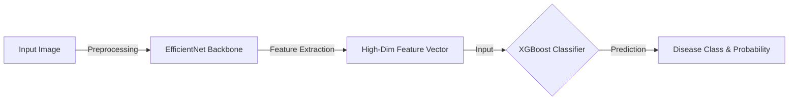

# 🍅 Tomato Disease Detection: Hybrid EfficientNet-XGBoost Architecture

[](https://www.python.org/)
[](https://flask.palletsprojects.com/)
[]()

A robust web application for diagnosing tomato leaf diseases using a **Hybrid Ensemble Learning** approach. By combining **EfficientNet** for deep feature extraction and **XGBoost** for classification, this system achieves superior accuracy and inference speed compared to traditional CNNs.

## 🚀 Key Features

* **Hybrid Architecture:** Leverages the power of Deep Learning (EfficientNet) and Gradient Boosting (XGBoost).
* **Dual Input Modes:**
    * 📂 **File Upload:** Analyze existing images.
    * 📷 **Live Camera/Canvas:** Capture and analyze in real-time.
* **Vietnamese Localization:** Full support for Vietnamese disease names (e.g., *Early Blight* $\rightarrow$ *Bệnh mốc sớm*).
* **Confidence Scoring:** Displays Top-3 probable diseases with confidence percentages.

## 📸 Screenshots
<!-- Add your application screenshots here -->

## 🧠 Model Pipeline (How it works)

The system moves beyond standard Softmax classification by using a two-stage pipeline:



## 🛠️ Installation & Setup

Follow these steps to run the project locally on your machine:

**1. Clone the repository**
```bash
git clone https://github.com/smolsosweet/Tomato-Disease-EfficientNet-XGBoost.git
cd Tomato-Disease-EfficientNet-XGBoost
```

**2. Create a Virtual Environment (Recommended)**
```bash
python -m venv venv
# On Windows:
venv\Scripts\activate
# On macOS/Linux:
source venv/bin/activate
```

**3. Install Dependencies**
```bash
pip install -r requirements.txt
```

## 💻 Usage

Start the Flask web server by running:
```bash
python app.py
```
Then, open your web browser and navigate to: `http://127.0.0.1:5000`

## 📁 Project Structure

```text
├── model/                  # Contains pre-trained weights (EfficientNet & XGBoost)
├── templates/              # HTML Frontend files
├── app.py                  # Flask Web Server entry point
├── predict.py              # ML Pipeline and prediction logic
├── requirements.txt        # Python dependencies
└── README.md               # Project documentation
```
